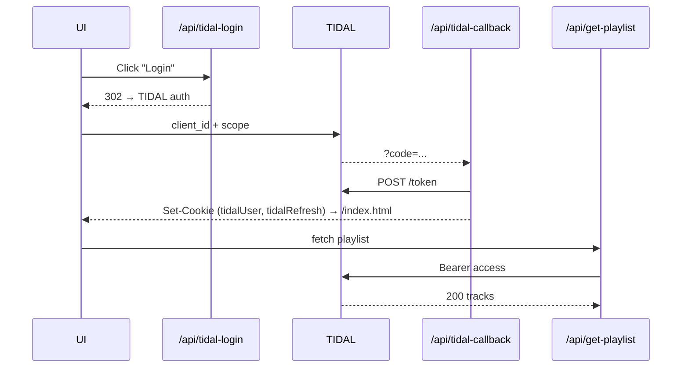

# TIDAL OAuth Architecture

## OAuth Flow Diagram



## Token Management

| Token | Stored as | Refresh trigger |
|-------|-----------|-----------------|
| access | `tidalUser` cookie | –300 s proactive / 401 reactive |
| refresh | `tidalRefresh` cookie | Exchanged for new access |

## Security Features

1. **CSRF Protection**: State parameter validation during OAuth callback
2. **Secure Cookies**: HttpOnly, SameSite=Lax, Secure flags set
3. **Token Rotation**: Automatic refresh on expiry with race condition prevention
4. **No Client Secrets**: OAuth secrets stay server-side only

## API Endpoints

### `/api/tidal-login`
- Initiates OAuth flow
- Generates CSRF state token
- Redirects to TIDAL authorization URL

### `/api/tidal-callback`
- Handles OAuth callback
- Validates state parameter
- Exchanges code for tokens
- Sets secure cookies
- Redirects to main app

### `/api/get-playlist-oauth`
- Requires authenticated session (cookies)
- Auto-refreshes expired tokens
- Returns formatted playlist data
- Falls back gracefully on errors

## Implementation Details

### TidalApiClient Class
- Centralized token management
- Automatic refresh with 5-minute buffer
- Retry logic for expired tokens
- Test helper for unit testing

### Race Condition Prevention
The get-playlist endpoint uses an in-memory promise cache to prevent multiple concurrent token refreshes:

```javascript
let refreshPromise = null;

if (!refreshPromise) {
  refreshPromise = client.refreshAccessToken()
    .finally(() => { refreshPromise = null; });
}
const { accessToken } = await refreshPromise;
```

See **COMMON_PITFALLS.md** for implementation gotchas.